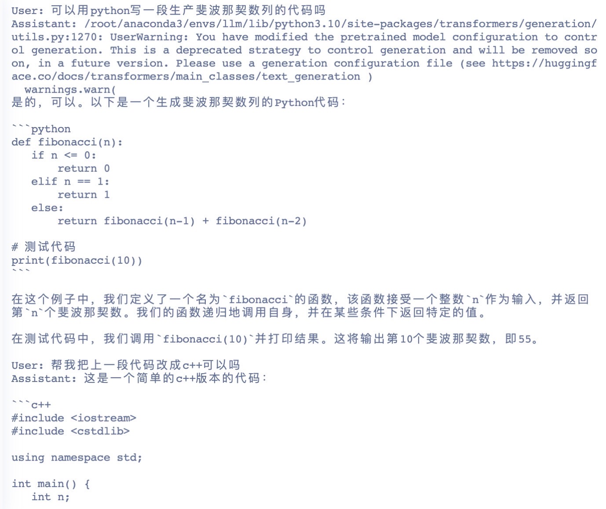
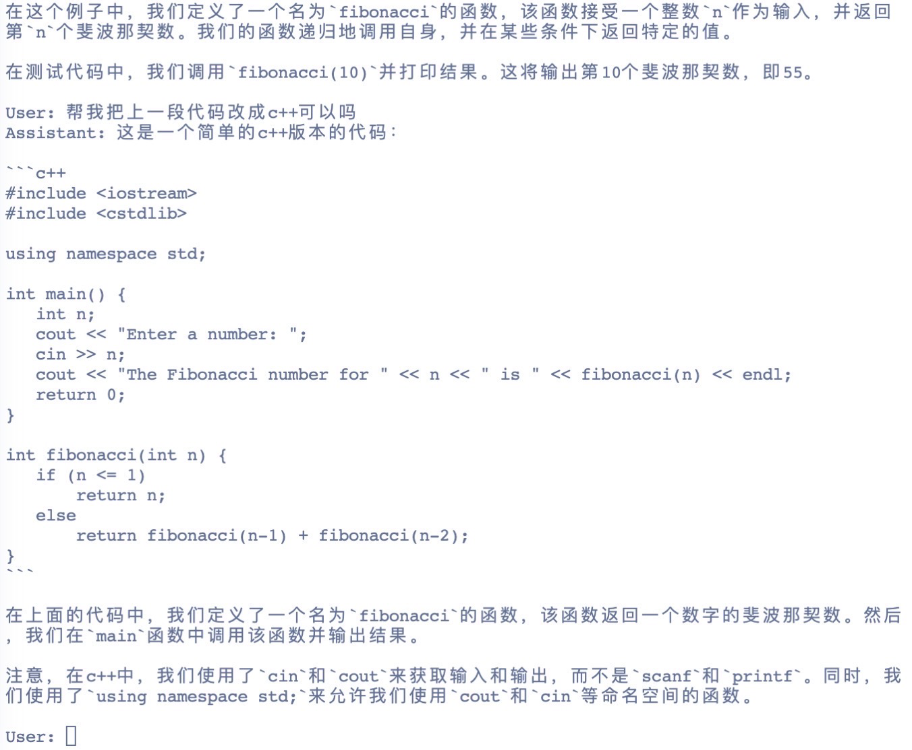
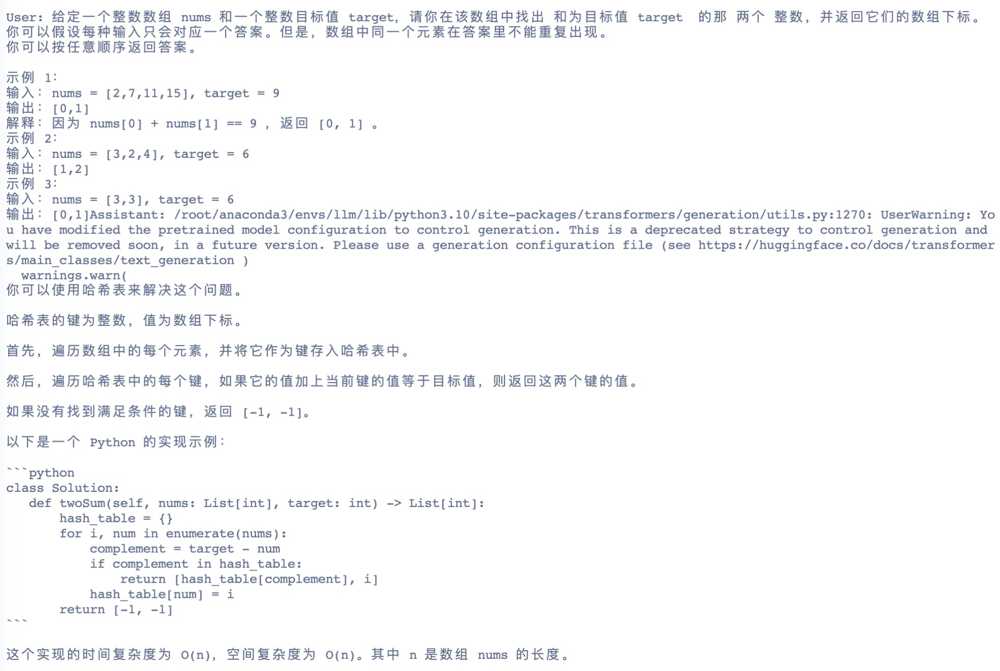
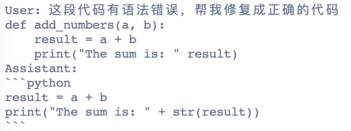

# ChineseCodeLlaMA

中文增强的代码大模型

## Datasets

[部分代码sft中英文数据](https://huggingface.co/datasets/nchen909/hugcode-codesft)

## Models

[codellama-7b-chinese-sft-v1](https://huggingface.co/nchen909/codellama-7b-chinese-sft-v1)

微调数据包括alpaca_gpt4_zh等

[codellama-7b-python-sft-v1.1](https://huggingface.co/nchen909/codellama-7b-python-sft-v1.1)

微调数据包括Evol-Instruct-Python等

[codellama-7b-chinese-sft-v1.2](https://huggingface.co/nchen909/codellama-7b-chinese-sft-v1.2)

微调数据包括CodeGPT等

[codellama-7b-sft-v1.3](https://huggingface.co/nchen909/codellama-7b-sft-v1.3)

清洗并收集大量中英文代码数据用于对话

[codellm-7b-v1.4](https://huggingface.co/nchen909/codellm-7b-v4)

## Getting Started

### Data Preparation

修改data/datasets_info.json，数据格式

```
"codegpt": {
    "file_name": ".../code_instruct.json"
    "columns": {
      "prompt": "instruction",
      "query": "input",
      "response": "output",
      "history": "history"
     }
```

### SFT with lora

```bash
deepspeed --num_gpus 8 --master_port=9901 src/train_bash.py     --deepspeed ds_config.json     --stage sft     --model_name_or_path /nchen909/workspace/codelab/CodeLlama-7b-Instruct-hf     --do_train     --dataset codesft     --template default     --finetuning_type lora     --lora_target q_proj,v_proj     --output_dir path_to_sft_checkpoint     --overwrite_cache     --per_device_train_batch_size 4     --gradient_accumulation_steps 4     --lr_scheduler_type cosine     --logging_steps 10     --save_steps 1000     --learning_rate 5e-5     --num_train_epochs 3.0     --plot_loss     --fp16     --overwrite_output_dir
```

### SFT with full param

```bash
deepspeed --num_gpus 8 --master_port=9901 src/train_bash.py --deepspeed ds_config_zero3.json --stage sft --model_name_or_path /nchen909/workspace/codelab/CodeLlama-7b-Instruct-hf --do_train --dataset code_exer --template default --finetuning_type full --output_dir path_to_sft_checkpoint --overwrite_cache --per_device_train_batch_size 1 --gradient_accumulation_steps 16 --lr_scheduler_type cosine --logging_steps 10 --save_steps 1000 --learning_rate 5e-5 --num_train_epochs 3.0 --fp16 --plot_loss  --overwrite_output_dir
```

### Test

```bash
python src/cli_demo.py     --model_name_or_path /nchen909/workspace/codelab/CodeLlama-7b-Instruct-hf     --template default     --finetuning_type lora     --checkpoint_dir checkpoint-30000
```

### Predict

```bash
CUDA_VISIBLE_DEVICES=0 python src/train_bash.py     --stage sft     --model_name_or_path /nchen909/workspace/codelab/CodeLlama-7b-Instruct-hf     --do_predict     --dataset codealpaca     --template default     --finetuning_type lora     --checkpoint_dir path_to_sft_checkpoint     --output_dir path_to_predict_result     --per_device_eval_batch_size 8     --max_samples 100     --predict_with_generate
```

### Convert ckpt to hf 

```bash
python src/export_model.py \
    --model_name_or_path /nchen909/workspace/codelab/CodeLlama-7b-Instruct-hf \
    --template default \
    --finetuning_type lora \
    --checkpoint_dir path_to_sft_checkpoint \
    --output_dir v1.3
```

### Upload model to huggingface

```python
>>> from huggingface_hub import HfApi
>>> api = HfApi()
>>> api.upload_folder(
...     folder_path="checkpoint-30000",
...     repo_id="username/reponame",
...     repo_type="model",
... )
```


## 效果

 支持中文对话，包含代码生成、翻译、修复等功能








